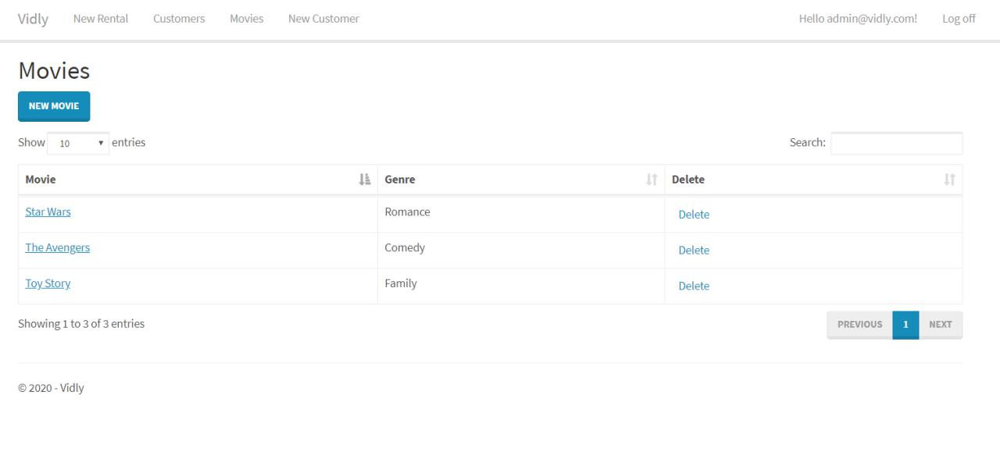

# Project Title - Vidly ASP

A Project that is built using ASP.NET MVC 5.

This is an example af an ASP.NET MVC application, following the tutorial of Mosh Hamedani.

## How to run the project

- Have  Visual Studio 2017 or 2019 installed
- Before running the project, ensure the nuget packages are restored
- Run the project with F5 (Ensure Migration is completed, can use EF commands : Update-Database)

### Live-Preview

Visit this link (https://vidlyasp20200117043708.azurewebsites.net/) for a live preview of the application.